# Conv_onet (**ECCV 2020**)

> **Title:**  Convolutional Occupancy Networks
>
> **Code:** [Convolutional Occupancy Networks (github.com)](https://github.com/autonomousvision/convolutional_occupancy_networks)
>
> **Paper:** [click here](https://arxiv.org/pdf/2003.04618.pdf)

## Methods

现有的大多数隐式表征方法受限于*comparably simple geometry of single objects*，不能放大到*more complicated or large-scale scenes.* 受限的因素在于*simple fully-connected network architecture*不允许*integrating local information in the observations*，而且不能*incorporating [inductive biases](https://www.zhihu.com/question/264264203) such as [translational equivariance](https://chriswolfvision.medium.com/what-is-translation-equivariance-and-why-do-we-use-convolutions-to-get-it-6f18139d4c59)*.

CNN网络架构具有平移不变性*translation equivariant*，即当图片中的物体左右变换时，不需要重新训练网络参数，仍然有好的表现。利用CNN的归纳偏置*inductive biases*，将**convolutional encoders和implicit occupancy decoders**结合，可以使效果*scalable and equivariant*。


**Encoder：**将一个有噪声的点云*noise point cloud*或者粗糙的占有网格*coarse occupancy grid*输入CNN编码器，得到每个点或体素的特征编码，构建平面或立体的特征表征，如立体的特征编码$H*W*D*c$ (c表示每个特征的维度，如32位)。

**Decoder：**解码器使用U-Net网络结构处理特征编码，其中U-Net网络结构由一系列的上采样下采样卷积*with skip connection*组成，能够整合局部和全局信息。

**Occupancy Prediction：**在获得编码的feature map后，给定三维空间的一点P，通过线性插值的方法查询特征值，最后使用解码器预测其占有概率。

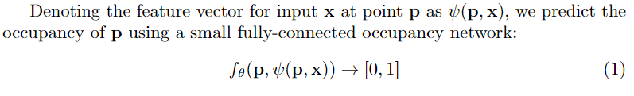

> **思考**：本文的方法是对于O-Net的改进，但仍然是off-line的重建方式。本文考虑到O-Net不具有scalable，不能放大到复杂的场景中，作者考虑了CNN网络结构归纳偏置的平移不变性，将CNN编码和MLP解码结合，建立一个scalable的系统

## Training

**Loss function:** Binary cross-entropy loss

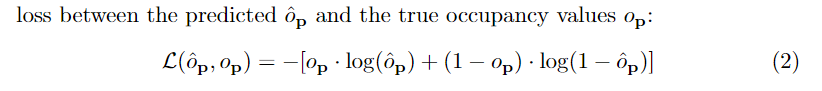

**Optimizer:** Adam, learning rate: 0.0001

**Inference:** 采用多分辨率等值面提取*Multiresolution IsoSurface Extraction(MISE)*算法从函数空间中恢复高精度的三维模型

## Experiments

**Datasets:** ShapeNet, *Synthetic Indoor Scene Dataset*, ScanNet v2, Matterport3D 

**Baselines:** ONet, PointConv, SPSR

## Cite

```bibtex
@inproceedings{Peng2020ECCV,
 author =  {Songyou Peng, Michael Niemeyer, Lars Mescheder, Marc Pollefeys, Andreas Geiger},
 title = {Convolutional Occupancy Networks},
 booktitle = {European Conference on Computer Vision (ECCV)},
 year = {2020}}
```


# iMAP([ICCV 2021](https://iccv2021.thecvf.com/))

> **Title:**  iMAP: Implicit Mapping and Positioning in Real-Time
>
> **Project Page：** [here](https://edgarsucar.github.io/iMAP/)
>
> **Paper：** [click here](http://openaccess.thecvf.com/content/ICCV2021/papers/Sucar_iMAP_Implicit_Mapping_and_Positioning_in_Real-Time_ICCV_2021_paper.pdf)

## Methods

iMap是**首个使用MLP隐式表示场景**的基于RGB-D相机的 Real-time SLAM系统。网络训练无需先验知识，使用现场的场景进行训练。系统将会生成一个**dense,scene-specific implicit 3D model of occupancy and color**，同时可以追踪相机轨迹。iMAP采用了一个新颖的**关键帧选择算法**，以及**多处理计算流**用于加速。相比于标准的稠密SLAM系统，iMAP可以更加**自动细节平滑的场景表示**，并且可以**合理的填充未被观测到的区域**，如物体的背面。

>**思考：**神经网络的遗忘性问题，不能保持stability，不能preserving old knowledge。*Overcoming catastrophic forgetting in neural networks.*提出相对加权的方法减轻遗忘问题，*On the Representation and Estimation of Spatial Uncertainty*的EKF方法也是一个值得研究的问题。子网络的冻结或巩固的方法，在SLAM系统中似乎不太适用？
>
>本文用keyframe set去保存之前的观测到的场景信息，并通过新的keyframe来添加新信息。*持续学习(Continual Learning)*

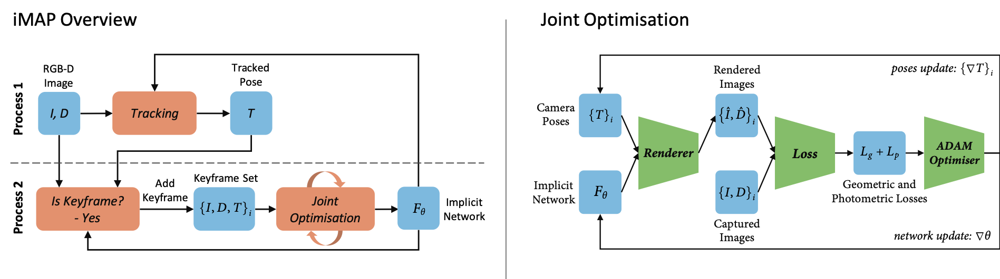

**Pipeline**：主要包括两个进程，Tracking进程相对于当前的网络去优化位姿，Mapping进程对关键帧联合优化网络参数和位姿。

**Neural Network**：借鉴NeRF，网络模型为一个具有4个隐藏层的MLP，每层feature size为256，输出color和volume density。采用**高斯位置编码**将3D坐标编码，输入MLP，并优化位置编码的参数。

**Differentiable Rendering**：对于采样点的像素坐标，反投影其3D点坐标，在投影射线上采样n个深度值。在网络中查询n个3D点的color和*volume density*。通过对density乘上样本间距离并通过激活函数将其转换为*occupancy probability*，计算出每条射线的*termination probability*。从而计算出depth和color，还可以计算出depth variance。

**Joint optimization**：对于*a set of W keyframe* 联合优化其相机位姿和网络参数，render函数对于这些参数是可微分的，通过对每个关键帧中选择的渲染像素最小化其*geometric and photometric*损失，可以不停地迭代优化参数。

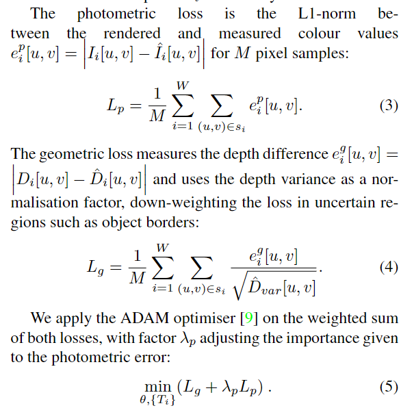

**Camera Tracking**：网络参数固定，以同样的损失和优化器去优化当前帧的位姿，若该帧为关键帧，以追踪后的位姿为初始位姿，在Mapping中继续联合优化。

**Keyframe Selection：**第一帧总是被挑选的，用于初始化网络，并且确定世界坐标系。每当有一个新的关键帧添加进来，锁定一个当前网络的3D map副本，后续的帧根据这个副本进行检测，判断是否出现明显的新区域，从而选择作为关键帧。

**Active Sampling：**

在Mapping联合优化时，从每张图像采样200个像素点进行渲染计算损失。iMAP采用主动采样技术，将每张图像分为8*8个grid，先在整张图像上随机采样n个点，计算每个grid中包含采样点的平均损失，根据grid损失分布确定每个grid采样点数量。若某个grid损失较高，说明该区域具有较复杂的细节，采样点分布越多。（Tracking只使用均匀采样）


在Keyframe Selection中也可以使用主动采样的方式，希望在有更高损失的关键帧上采样更多的样本，因为这些关键帧可能包括高细节、未观测到的新的区域或者网络开始遗忘(forgetting)。将最新的关键帧组成W=5的窗口，包含当前帧，计算每个关键帧的损失分布，选择3个关键帧采样。

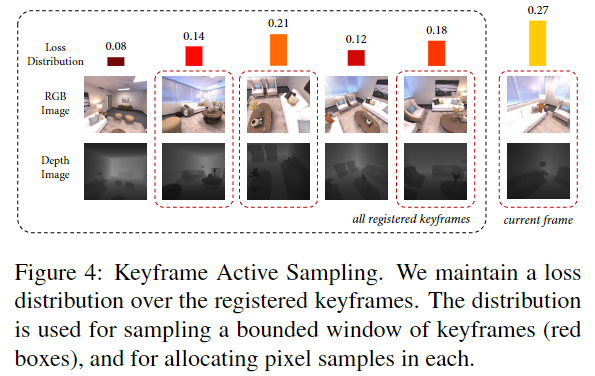

## Experiments

手持RGB-D相机在线实时处理，帧率在10HZ。保存mesh模型可以通过网络去查询每个voxel grid的occupancy，再使用marching cube去恢复模型。Meshing只是用于visualisation和evaluation，并不属于SLAM系统的一部分。

**Datasets**：Replica、capture RGB-D videos、TUM RGB-D

**Baseline：**TSDF Fusion、BAD-SLAM、Kintinuous、ORB-SLAM2

iMAP的位姿准确率不如标准的SLAM系统，但是iMAP可以**填充未观测到的空洞区域**，占用内存更小。

消融实验证明，**使用Active Sampling可以加速准确率收敛**。

## Cite

```bibtex
@inproceedings{sucar2021imap,
  title={iMAP: Implicit mapping and positioning in real-time},
  author={Sucar, Edgar and Liu, Shikun and Ortiz, Joseph and Davison, Andrew J},
  booktitle={Proceedings of the IEEE/CVF International Conference on Computer Vision},
  pages={6229--6238},
  year={2021}
}
```


# NICE-SLAM (CVPR 2022)

>**Title：** NICE-SLAM: Neural Implicit Scalable Encoding for SLAM
>
>**Paper：** [here](https://arxiv.org/pdf/2112.12130)
>
>**Code：** [NICE-SLAM (pengsongyou.github.io)](https://pengsongyou.github.io/nice-slam)
>
>**Supplementary ：** [Supplementary Material ](https://openaccess.thecvf.com/content/CVPR2022/supplemental/Zhu_NICE-SLAM_Neural_Implicit_CVPR_2022_supplemental.pdf)

## Methods

现有的神经隐式表示方法会产生过度平滑的场景表面，并且难以放大到大的复杂场景。局限性主要在于**简单的全连接网络结构，不能在观测中整合局部信息**。NICE-SLAM引入了一种**层次级的场景表示结构**，整合多层级的局部信息。利用预训练的集合先验优化，可以对大型室内场景进行细节级的重建。相比于其他神经隐式SLAM系统，该方法具有***scalable，efficient，robust***。

理想的SLAM系统：**1. 实时性。2.做出合理预测。3. 可以放到大场景中。4. 对噪声或缺失的观测信息有鲁棒性。**

传统的SLAM：1，3，但不能对未观测区域做出合理预测

基于学习的SLAM：可以实现特定场景重建，能更好地处理噪声和异常点，但是只能应用于多个物体的小场景。iMAP在SLAM领域实现了不错的效果，但应用于大场景，效果骤降。关键在于，[iMAP](# iMAP(ICCV 2021))使用单一的MLP去表示整个场景，只能在每次新的或部分观测中进行全局更新。

>也有一些工作表明多层级的grid feature有利于保留几何细节，可以重建复杂的场景，但是这些都是离线的方法。作者结合了这些方法的长处，推出了NICE-SLAM，主要是使用了hierarchical feature grids和预训练神经隐式解码器的先验inductive biases。通过解码器输出的occupancy和color重新渲染彩色图和深度图，最小化re-rendering损失来优化只在视野内的特征网格。

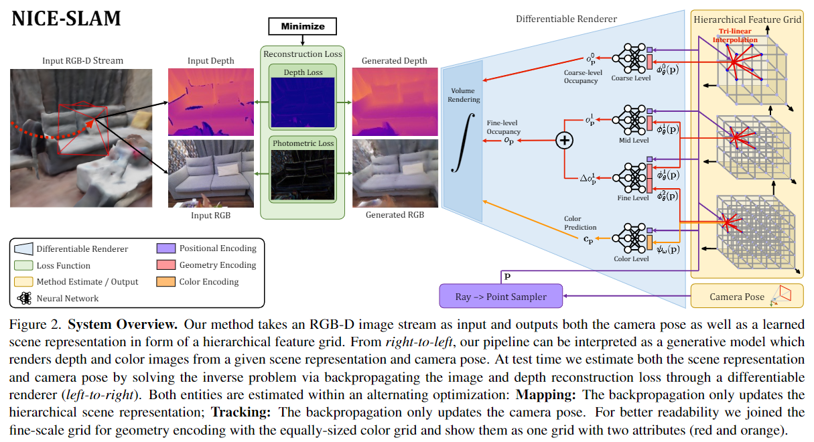

PIpeline类似于iMAP，主要包括Mapping和Tracking两个进程，同时又借鉴了Conv_onet的特征编码器。主要改进在于增加了一个*coarse-middle-fine的层次级特征网格*，*预训练coarse-fine解码器的几何先验参数*，在迭代优化时只更新特征网格参数feature grid。对于输入的RGB-D帧，在图像上随机采样，将采样点和feature grid插值所得的特征值送入不同阶段的解码器中，输出occupancy和color，渲染出深度图和颜色图，通过最小化渲染损失，优化特征网格参数。Tracking进程固定特征网格参数和网络解码器参数，**只优化每一帧的位姿**。Mapping进程对**关键帧的位姿和特征网格参数以及网络参数**联合优化。

### Hierarchical Scene Representation

层次级场景表示主要结合了**多层次的特征网格和预训练的多级解码器**，主要优化的参数是每个层级的特征网格以及color decoder参数，其他decoder参数已预训练完成。

**Coarse Level：** coarse特征网格较大，分辨率更低，针对捕捉高层次的场景几何信息，如墙，地板，单独进行优化参数。主要目的去预估观测不到几何场景的occupancy(因为可以观测到的几何信息会被mid-fine解码)。采样到的3D点在coarse特征网格插值得到特征值，将特征值和3D点输入coarse解码器得到occupancy。

**Middle-Fine Level：** middle和fine特征网格较小，表示观测到的几何信息。middle阶段，将3D点插值middle特征网格再输入到middle解码器得到occupancy，计算损失优化middle网格参数。为了捕捉更高频的场景细节，fine阶段以一种残差的方式实现，将3D点分别插值middle网格和fine网格，输入到fine解码器中，输出middle-level occupancy的偏差。因此，fine阶段真正的occupancy应当middle-occ加上偏差，fine阶段**将middle网格和fine网格参数都进行了优化**。

**Color Level：** color特征网格大小和fine网格大小一致。color阶段包含middle-fine阶段，计算出occupancy值。然后将3D点在color网格上插值，输入color解码器中，输出color。计算损失优化**middle，fine，color特征网格参数以及color解码器网络参数**。经验发现优化特征网格和color解码器可以提高Tracking性能。

### Rendering

和NeRF类似，从图像上采样后，会得到r条射线，在每条射线最近到最远深度上均匀采样，该文章又在**深度值附近均匀采样**，总共得到n个深度采样。将$n*r$个点输入网络解码器得到occupancy，由公式转换为终止概率，从而计算出该采样点渲染的depth和color，以及depth variance。*(和[iMAP](# iMAP(ICCV 2021))类似，iMAP得到density，转换为Occupancy)*

### Mapping

Mapping过程优化**各层次级的网格参数和color解码器以及关键帧的位姿**。在当前帧和挑选的关键帧上均匀采样像素点，输入网络中渲染depth和color，计算与真值的几何误差和光度误差。*([iMAP](# iMAP(ICCV 2021))是主动采样)*

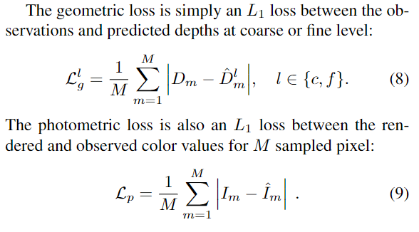


### Tracking

Tracking进程只优化当前帧的位姿。同样的，在当前帧上采样，得到预测的depth和color，光度损失和上述一样，几何损失稍有不同。*(改进的和iMAP类似）*

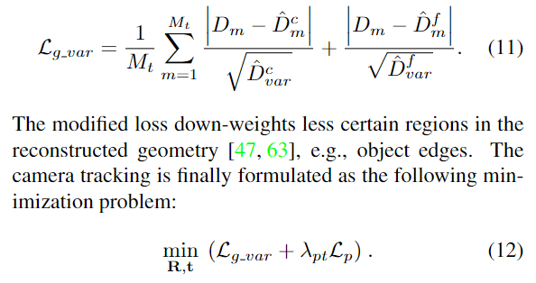

另外，为了提升系统对动态物体的鲁棒性，在Tracking时，过滤掉具有较大re-rendering损失的像素。特定情况下，如果该像素的损失($Eq.12$)大于当前帧上所有像素损失的中位数$*10$，则去除掉该像素。*(这是个不错的未来研究方向)*

### Keyframe Selection

和[iMAP](# iMAP(ICCV 2021))类似，有一个全局的关键帧列表，逐步添加新的关键帧。不一样的是，在优化场景几何信息时，只优化与当前帧有视觉重叠的关键帧。这样可以对网格进行局部更新，不会遭受遗忘问题。不仅可以保证不在当前帧内的场景信息保持不变，还可以只优化每次一些必要的参数。

## Experiments

**Datasets**： Replica，ScanNet，TUM RGB-D，Co-Fusion，self-captured large apartment with multiple rooms.

**Baseline：** TSDF-Fusion，DI-Fusion，iMAP

重建效果上优于baseline，在相机追踪效果上，虽然不如传统的标准SLAM系统，但缩小了神经隐式方法与传统方法的差距。相比于iMAP，不仅提升了重建和追踪的效果，参数较少，速度上也更快。对于动态物体的鲁棒性也不错。由于使用了coarse解码器的先验知识，在预测填充空洞上也有不错的效果。

## Cite

```bibtex
@inproceedings{Zhu2022CVPR,
  author    = {Zhu, Zihan and Peng, Songyou and Larsson, Viktor and Xu, Weiwei and Bao, Hujun and Cui, Zhaopeng and Oswald, Martin R. and Pollefeys, Marc},
  title     = {NICE-SLAM: Neural Implicit Scalable Encoding for SLAM},
  booktitle = {Proceedings of the IEEE/CVF Conference on Computer Vision and Pattern Recognition (CVPR)},
  year      = {2022}
}
```


# MonoSDF (2022)

>**Title：** Exploring Monocular Geometric Cues for Neural Implicit Surface Reconstruction
>
>**Paper：** [here](https://arxiv.org/pdf/2206.00665.pdf)
>
>**Code：** [here](https://niujinshuchong.github.io/monosdf/)

## Methods

神经隐式表面重建由于神经网络的归纳偏置(inductive bias)，可以产生更加平滑复杂的重建效果。但是，对于更大更复杂的场景，或者只从稀疏的几个视角点捕捉到的场景，神经隐式重建的效果将会大打折扣。因为*RGB重建损失inherent ambiguity没有足够的约束条件*，特别在较少观测到的区域或没有纹理的区域。

> **思考：**只使用RGB损失优化会导致约束不足的问题，因为photo-consistent存在无边界的场景，无限的数目。作者从单目几何领域中获得启示，发现depth and normal cues, predicted by general-purpose monocular estimators, 可以很大地提高重建质量和优化时间。另外，发现geometric monocular priors在小场景单目标和大场景多目标都可以提高性能。*(与 [Manhattan-SDF](# Manhattan-SDF  (CVPR2022))类似)*

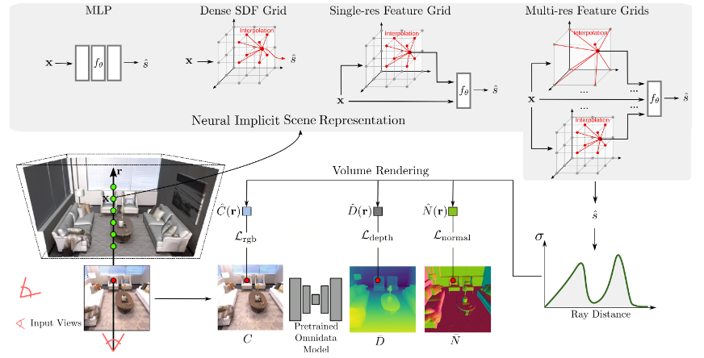

### Implicit Scene Representations

**Dense SDF Grid：** 将场景分为$H*W*D$分辨率的离散volume $V_\theta$，每个grid存储SDF值。对于任意一个3D点$x$，可以通过插值的方式查询到SDF值 $\hat{s}=\mathsf{interp}(x,V_\theta)$。

**Single MLP：**SDF函数可以通过一个MLP $f_\theta$进行表示：$\hat{s}=f_\theta(\gamma(x))$，其中$\gamma$表示位置编码，将$x$映射到高维空间。如[iMAP](#iMAP(ICCV 2021)).

**Single-Resolution Feature Grid with MLP Decoder：**如[Con_onet](# Conv_onet (ECCV 2020))，可以结合MLP解码器$f_{\theta}$和特征网格编码$\Phi_{\theta}$，特征网格的每个grid存储特征变量。$\hat{s}=f_{\theta}(\gamma(x), \mathsf{interp}(x,\Phi_{\theta}))$

**Multi-Resolution Feature Grids with MLP Decoder：**可以使用多分辨率的特征网格结合MLP解码器，比如[NICE-SLAM](#NICE-SLAM (CVPR 2022))。插值每个级别的grid得到特征值，并连接在一起。$\hat{s}=f_{\theta}(\gamma(x),\{\mathsf{interp}(x,\Phi^l_{\theta})\}_l)$

**Color Prediction：**为了表示颜色，还需另一个函数$c_{\theta}$，通过一个3D点$x$和视角方向$v$可以得到预测的RGB值。其中，$\hat{n}$为3D单位法向量，$\hat{z}$为特征向量。参考自[Multiview Neural Surface Reconstruction by Disentangling Geometry and Appearance](https://lioryariv.github.io/idr/)
$$
\hat{c}=c_{\theta}(x,v,\hat{n},\hat{z})
$$

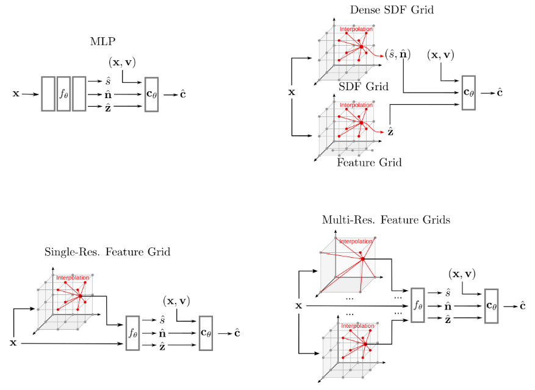

### Volume Rendering

使用可微分的体渲染技术可以对重建损失反向传播优化参数。为了render一个像素，在像素点与相机中心连线的射线方向$v$上采样多个点$x^i=o+t_r^iv$，并预测每个点的SDF $s_r^i$和color $c_r^i$，体渲染需要将SDF值$\hat{s}_r$转换为density值$\sigma_r$：

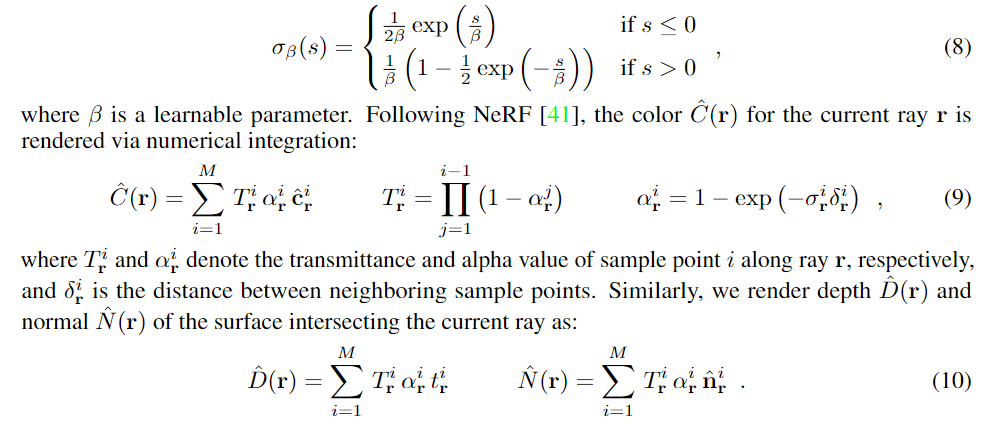

体渲染可以渲染出一个像素的**color，depth和该像素所在射线与表面相交的法线normal**。

### Monocular Geometric Cues

体渲染的隐式表面可以取得不错的重建效果，但是对于更复杂的场景，尤其是没有纹理或很少覆盖的区域，性能骤降。为了克服这个问题，使用单目几何先验知识可以提高隐式表面重建方法的效果。

**Depth Cues：**单目depth图可以通过现成的单目深度predictor获取，作者使用预训练的[Omnidata](https://omnidata.vision/)来预测每一张RGB图像的depth map。由于，在一般场景中，绝对比例很难估计，所以这里的预测depth map只作为一个相对深度信息cues。

**Normal Cues：**同样的，使用预训练的[Omnidata](https://omnidata.vision/)来预测每一张RGB图像的表面法线normal map。与depth cues的半局部相对信息不同，normal cues是捕捉局部的细节。可以认为，depth cues和normal cues是互补的。

### Optimization

**Reconstruction Loss：**通过上式计算的渲染color和观测到的color计算L1损失：

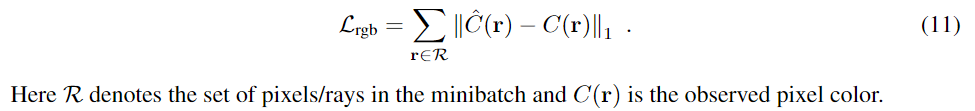

**Eikonal Loss：**在采样点上加入Eikonal正则化SDF值：

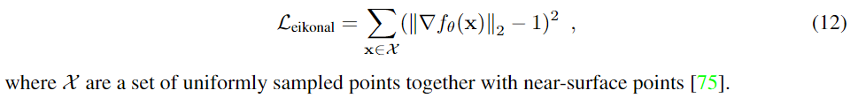

**Depth Consistency Loss：**为了计算深度一致性，将渲染的深度和单目预测的深度做L2损失，其中由于预测的depth map只是相对深度，还需求解出其对应的比例和偏移。

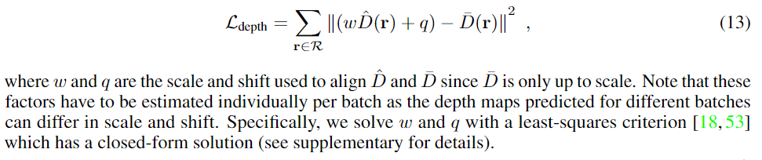

**Normal Consistency Loss：**计算体渲染得到的normal和单目几何预测的normal的**L1损失以及法线方向的角度损失**作为法线一致性loss.

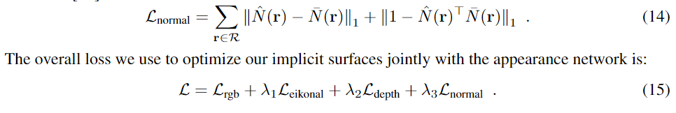

**实验细节：**[more see supplementary]()

1. Adam优化器：MLP学习率为0.0005，特征网格的学习率为0.01.
2. 损失权重$\lambda_1,\lambda_2,\lambda_3$分别为0.1，0.1，0.05.
3. 每个迭代采样1024个点，采用[VolSDF](https://proceedings.neurips.cc/paper/2021/hash/25e2a30f44898b9f3e978b1786dcd85c-Abstract.html)的error-bounded采样策略。
4. MLP架构参考自[VolSDF](https://proceedings.neurips.cc/paper/2021/hash/25e2a30f44898b9f3e978b1786dcd85c-Abstract.html)，特征网格初始化机制参考自[Instant-NGP](https://arxiv.org/pdf/2201.05989).
5. 将每张图像中心裁剪到$384*384$，使用预训练的[Omnidata](https://omnidata.vision/)获取单目几何cues。

## Experiments

  **Datasets：**

- 真实室内场景：Replica，ScanNet

- 真实的大型室内场景：Tanks and Temples advanced scenes

- 目标级场景：只有稀疏3视角的DTU

**Baselines：**

- SOTA 神经隐式方法：UNISURF，[VolSDF](https://proceedings.neurips.cc/paper/2021/hash/25e2a30f44898b9f3e978b1786dcd85c-Abstract.html)，NeuS， [Manhattan-SDF](# Manhattan-SDF  (CVPR2022))

- 经典MVS方法：COLMAP，SOTA商业软件[RealityCapture](https://www.capturingreality.com/)

- 带有预测的单目depth cues的TSDF-Fusion，用来验证只使用单目depth cues而不用隐式方法的重建效果。

**Metrics：**[Chamfer Distance, F-score](https://blog.csdn.net/ojbko/article/details/102462871)with a threshold of 5cm, Normal Consistency **(see supplementary)**

### Ablation Study

作者首先对不同架构选择的方法做了实验对比，发现：

1. 由于神经网络的inductive smooth bias，使用Single MLP会得到over-smooth的效果，缺少细节。
2. 使用Dense SDF Grid相比于神经隐式方法，效果会差得多，导致noisy的重建效果。每个grid的SDF值相互独立，没有局部或全局的smooth bias。
3. 采用Single Fea-Grid with MLP相比于只使用Grid会取得显著的效果，性能和Single MLP类似。
4. Multi-Res Fea-grid with MLP有着最好的表现。

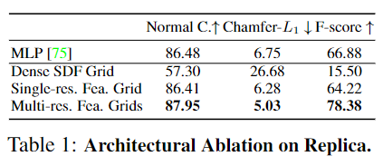

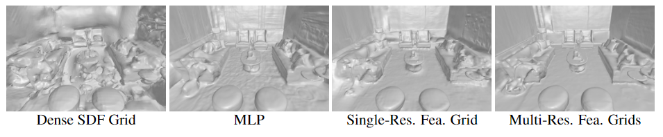

然后对两种单目cues做了实验比对，可以看到使用其中一种cues或都使用可以取得明显的效果提升。两种cues是互补的，同时使用depth和normal cues可以达到最好的效果。其中将cues使用到**Single MLP**上会获得最好的效果。在Optimization方面，可以看到**Multi-Res Fea-Grid**比Single MLP收敛更快，加入Cues可以显著的加速收敛过程，

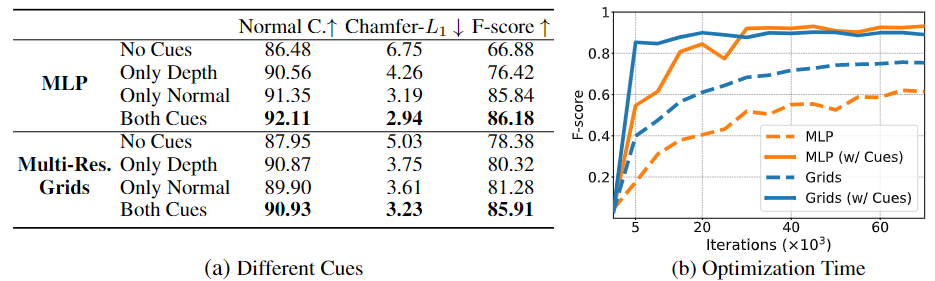

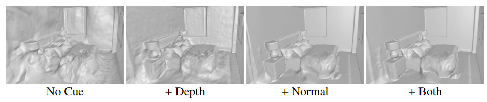

### Real-world Large-scale Scene Reconstruction

在**ScanNet**室内场景上，MonoSDF相比于其他方法取得了SOTA的效果，而且MLP+cues比Multi-Grid+cues效果更好。

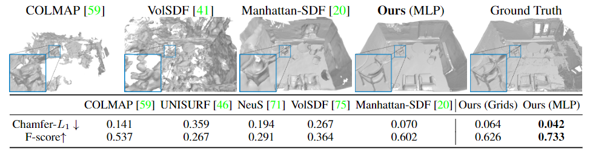

在**Tanks and Temples**大型数据集上，使用单目cues可以显著增加VolSDF的性能，使得第一个神经隐式的方法可以在大型场景下取得合理的效果。

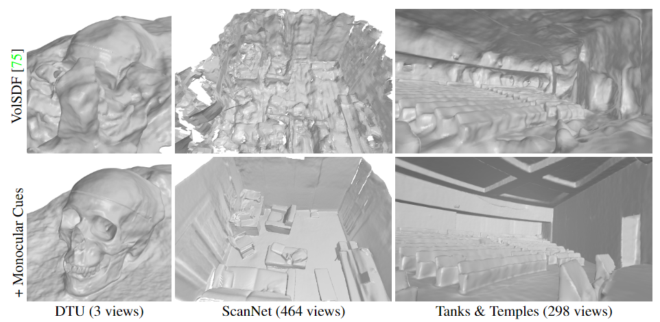

### Object-level Reconstruction from Sparse Views

在只有3个视角的**DTU**数据集上，MLP+cues仍然具有最好的表现。只使用cues的TSDF-Fusion也不能去的很好的效果，表明结合神经隐式与单目几何cues对较少观测到的区域有着更强的鲁棒性。

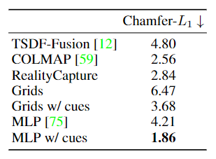

通过上述实验表明，MLP+cues在更复杂的场景或更少观测的视角有着很不错的效果，尽管收敛速度相较于Multi-Grid+cues较慢。而多分辨率的特征网格可以加速收敛并捕获细节，但是对输入图像的噪声或模糊，鲁棒性较差。

> *Thinking:* 
>
> 1. 在前面NICE-SLAM或iMAP的基础上，是否可以添加单目几何cues来提升效果
> 2. 单一的MLP加上cues会有着更好的效果，可以先在iMAP上实验
> 3. 本文只是利用RGB图，并没有使用真值depth map，是否可以在计算损失时，计算渲染的depth与真值，以及渲染的depth与depth cues以某种权重，计算联合损失
> 4. 本文没有考虑优化相机位姿
> 5. 本文不具有实时性
> 6. 是否可以在预训练的单目模型上做出改进

## Cite

```bibtex
@article{Yu2022MonoSDF,
  author    = {Yu, Zehao and Peng, Songyou and Niemeyer, Michael and Sattler, Torsten and Geiger, Andreas},
  title     = {MonoSDF: Exploring Monocular Geometric Cues for Neural Implicit Surface Reconstruction},
  journal   = {arXiv:2022.00665},
  year      = {2022},
}
```


# iSDF (**RSS 2022**)

>**Title：** iSDF: Real-Time Neural Signed Distance Fields for Robot Perception
>
>**Paper：** [here](https://arxiv.org/pdf/2204.02296)
>
>**Code：** [iSDF (joeaortiz.github.io)](https://joeaortiz.github.io/iSDF/)

## Methods

本文提出iSDF*(incremental Signed Distance Fields)*，可以实时SDF重建的**持续学习**系统*(continual learnning)*。给定相机的深度图以及相机位姿，实时训练一个随机初始化的网络，**输入3D坐标预测signed distance**。模型可以通过最小化预测的符号距离及其空间梯度损失**自监督**优化网络参数，损失函数可以限制*(bound)*预测的signed distance与**主动采样**的批次点中到最近表面的距离，并使远离表面的符号距离不需要波前传播*(wavefront propagation)*学习。iSDF使用神经网络的方法，可以自适应细节级地合理填充部分观察的区域，并且平滑降噪处理，可以更紧凑的表示方法，而且在场景中的不同部分可以不同*level of detail*地建模。iSDF是唯一可以重建zero level set的水密模型*(watertight mesh)*的方法。

> level of detail可以理解为在重要区域或者纹理较多的区域更加细节建模，在边缘区域或没有纹理的区域建模粗糙。水密模型即不漏水的模型，密封性较好。
>
> **思考：**本文只考虑Mapping问题，没有Tracking相机位姿的模块。可以考虑优化相机位姿改进为SLAM系统。

应用：iSDF在一些室内场景数据集中可以更准确的重建，在**collision cost和梯度**这些指标上优于其他方法，有利于*navigation to manipulation领域中的downstream planner*。在机器人感知领域，SDF在运动规划中可以用来避免碰撞。而SDF表示空间中每一个点到最近表面的符号距离，因此常常把表面编码为[zero level set](https://www.zhihu.com/question/22608763)。


SDF的几个属性：

1. SDF函数$f_{\theta}$几乎任何地方都是可微分的，当最接近表面有多个等距离的点时，是不可微分的。
2. 梯度存在时，梯度的反方向指向最近的表面；在表面上时，梯度等同于表面的法向量。
3. 梯度向量满足Eikonal等式：$|\Delta_xf|=1$。*Eikonal正则化*

### Network architecture

网络结构主要有一个MLP组成，4个隐藏层，每层维度256([和iMAP类似](#iMAP(ICCV 2021)))，使用**softplus**激活函数([monoSDF中也有](#MonoSDF (2022)))，采用[Mip-NeRF 360](https://arxiv.org/abs/2111.12077)的”off-axis“的位置编码方法，第三层残差结构连接。

### Active sampling

关键帧的选择方法大体上遵循[iMAP](#iMAP(ICCV 2021))的方法，有一个关键帧set避免遗忘问题，每次挑选5帧，2个最近帧，3个从关键帧集中采样的帧。在每一帧上随机采样200个像素点，得到投影射线。每条射线上采样$N+M+1$个深度值，其中在最近距离到表面深度值附近范围$[d_{min},D[u,v]+\delta]$上分层采样$N$个样本深度，高斯分布$G(D[u,v],\delta_s^2)$采样$M$个样本，另外还包括表面深度值$D[u.v]$.

实验中，$N=20,M=8,d_{min}=7cm,\delta=10cm,\delta_s=10cm$.

### Approximating the closest surface point

理想上，在得到预测的SDF后，用SDF真值来计算损失优化网络。SDF计算公式如下，$sgn$为符号函数，$D[u,v]$表示采样像素点射线上表面的深度值，$d$为3D样本点$x$的深度，若>0，则$x$在表面外，若<0，则$x$在表面内。$inf$为下确界函数，$S$为所有表面上的点，计算$x$到所有表面点中最近点的距离。

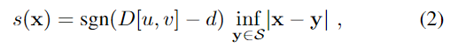

但是，遍历所有表面点与$x$的距离计算量太大。作者选择一种近似最近表面点的方法，在表面的附近找到一点$p$，但$p$不太可能是表面上的点，所以计算的SDF也不是真正的值，但可以提供SDF真值的上界。

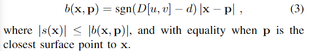

作者提出了3种方法来找到近似最近表面的点：

- 最简单的方法就是用射线与表面相交的点来计算上界：$b(x,D[u,v]r)=sgn(D[u,v]-d)|D[u,v]-d|$，如果表面刚好垂直射线方向，那么上界就是最好的效果，如果不垂直，效果会很差。

- 计算点到表面点切平面最近的点来进行计算：$b(x,\hat{r},\hat{n})=-\hat{r}.\hat{n}(d-D[u,v])$，这种方法还需要计算表面点的法向量。

- 作者使用暴力破解的方法，选择采样的批次点中最近的点作为近似点，可以计算出真正SDF上界bound：

  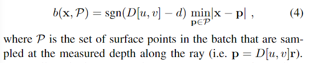

  同样，也可以计算出估计的SDF梯度：

  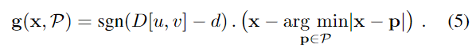

  作者经过实验后，发现第三种方法会取得最好的效果，而且不需要额外的计算。下面右图为不同射线选择不同方法所确定的上界，可以看到Batch distance的上界最接近真值SDF。

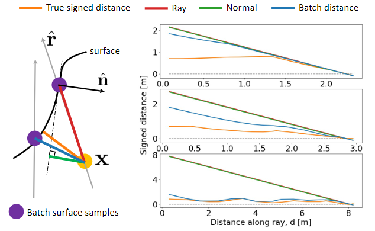

### Loss for self-supervised continual learning

**SDF Loss：**用预测SDF的上界，我们可以计算**自由空间的点**的损失。如果预测的SDF是正数且小于b，则损失为0；如果预测SDF超过b，损失为线性函数；如果预测SDF是负数，则损失为指数形式。在**表面附近的点**，用计算的SDF边界与预测SDF做L1损失。给定一个截断区域t，我们可以计算近表面点以及其他自由空间点的损失，从而得到整个SDF损失，其中接近表面点的损失乘上一个权重：

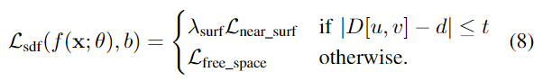

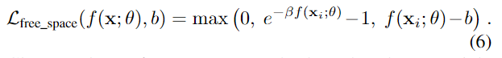

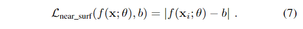

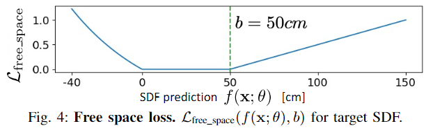

**Gradient loss：**通过自动微分可以计算出预测SDF的梯度，再与估计的SDF梯度，计算两个向量之间的余弦距离。如果采样点在表面上，以表面的法向量作为梯度进行计算。

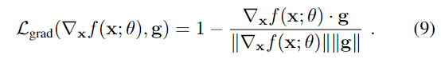

**Eikonal regularization：**仅凭上述的损失，不能保证学习的SDF满足Eikonal等式，引入正则化。但是，作者只正则化了距离射线交点大于$a=10cm$的点，提高了性能。因为在接近表面的点上，不满足Einkonal等式的梯度不连续性更为常见。

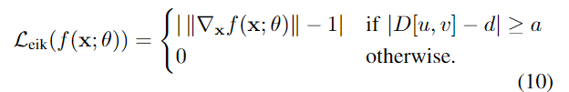

因此，通过最小化总损失，优化网络参数：

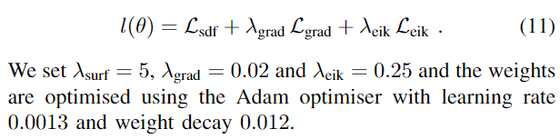

## Experiments

**Datasets：**ReplicaCAD，ScanNet

**Baseline：**Voxblox，KinectFusion+

**Metrics：**

1. SDF Error：计算预测与真值的绝对值。$e_{sdf}(x)=|\hat{s}(x)-s(x)|$.

2. Collision cost error：

   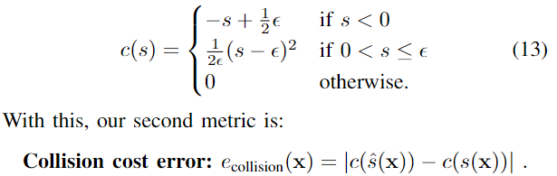

3. Gradient cosine distance:

   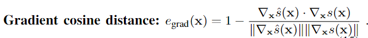

## Cite

```bibtex
@inproceedings{Ortiz:etal:iSDF2022,
  title={iSDF: Real-Time Neural Signed Distance Fields for Robot Perception},
  author={Ortiz, Joseph and Clegg, Alexander and Dong, Jing and Sucar, Edgar and Novotny, David and Zollhoefer, Michael and Mukadam, Mustafa},
  booktitle={Robotics: Science and Systems},
  year={2022}
}
```


# Neural RGB-D Surface Reconstruction (CVPR2022)

>**Title：** Neural RGB-D Surface Reconstruction
>
>**Paper** ：[here](https://openaccess.thecvf.com/content/CVPR2022/papers/Azinovic_Neural_RGB-D_Surface_Reconstruction_CVPR_2022_paper.pdf)

## Methods

使用MLP隐式表示表面的方法如NeRF，可以获取到高质量的3D重建效果，但是这类方法主要是复现出物体或场景的外观，而不是重建真实的表面。当使用Marching Cube提取表面时，基于density表示会导致artifacts*(伪影/失真)*，因为在优化过程中，density是通过射线上采样点累加得到的，而不是通过单个点。本文中建议使用**TSDF**的隐式方法表示表面，并将其整合到NeRF框架中。另外，作者还提出了一个相机位姿改进技术，可以提高整体的重建质量。

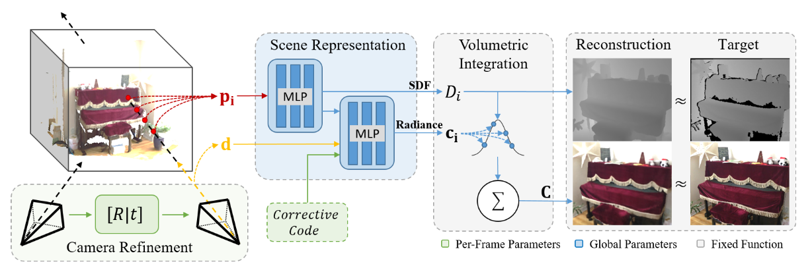

**Pipeline：**本文使用RGB-D序列的RGB帧及其对齐的Depth帧，优化整个场景表示网络。混合场景表示包括一个基于TSDF的隐式表面表示和一个radiance的体积表示。场景表示由两个MLP组成，输入采样点输出每个点的SDF，另一个MLP输出每个点依赖于视角方向的radiance。体积整合模块将射线上采样点的radiance通过函数整合为Color，每个样本点的SDF值和可视性作为函数的权重，该函数是固定的，无需学习。每帧还有个相应的潜在编码需要学习，潜在编码和射线方向输入到MLP解码radiance。通过计算采样点的SDF、整合的Color相对于真值RGB-D的损失，优化场景表示的**MLP网络参数、每帧的潜在编码参数、相机位姿、图像-平面deformation field**。用BundleFusion初始化相机位姿，用Marching Cube提取mesh模型。

### Hybrid Scene Representation

混合场景表示结合隐式表面表示和体积整合外观表示，通过MLP查询空间中任意点的SDF和视角相关的radiance。其中，对于每一个3D点$p_i$和视角方向$d$采用NeRF的正弦位置编码*(inusoidal positional encoding)*。

**颜色外观表示**将沿着射线上点的radiance加权总和作为渲染的Color，权重直接使用两个sigmoid函数的乘积从SDF值中进行计算。其中，$tr$代表截断距离，它可以控制当距离表面越来越远时，权重下降到0的速度。在截断区域外的样本点，其权重设置为0。当SDF值位于零点时即在表面上，该权重函数会到达峰值最大值。说明在表面附近时，权重会更大，距离表面较远时，权重较低。有了权重后，即可计算$K$个采样点radiance的加权总和，得到渲染的Color：

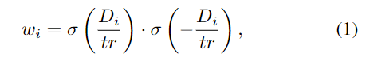

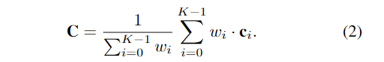

这种颜色渲染方法也是可微的，它可以通过光度损失推导出深度值，而且这种方法可以预测占用空间和自由空间的边界，从而重建出高质量的表面。与基于density的方法不同，他们在沿着射线渲染视角相关的颜色影响时，在表面前引入semi-transparent物质，这就导致了自由空间中的noise和artifacts。

**Network Architecture：** 混合场景表示包括两个MLP，分别表示shape和radiance。Shape MLP将**位置编码的3D点**为输入，输出TSDF值，第二个MLP给出**位置编码的视角方向**和**shape MLP的中间层输出**，输出表面的radiance。由于颜色数据经常受到不同的曝光或者白平衡，作者还使用**每帧的潜在编码向量**作为学习参数，并将其作为radianceMLP的输入。

**Pose and Camera Refinement：**用**欧拉角和平移向量**表示每帧的相机位姿，并用BundleFusion初始化，在优化过程中再次细化。另外，考虑到输入图像可能的扭曲或者相机内参的不确定性，作者还使用了*image-plane deformation field*，是一个6层的ReLU MLP，在反投影出3D射线前，将该MLP输出作为残差项加到像素点位置上。该MLP参数是全局的，对所有帧都一样。在优化期间，相机位姿首先移位到deformation field输出的2D向量，然后用相机位姿转换到世界空间。

### Optimization

从RGB-D图像上随机采样一批次像素点$P_b$，对于每一个像素点$p$，根据相应的相机位姿生成一条射线，并在射线上采样$S_p$个点。对于$B$批次的射线，我们通过最小化下述损失函数，来优化参数$\mathcal{P}$，包括**网络参数和相机位姿**。其中$\mathcal{L}_{rgb}^b(P)$表示第$b$批次所有采样像素点的真值Color与预测Color的L2均方差损失(MSE)；$\mathcal{L}_{fs}^b(P)$是自由空间点损失，使得射线上在相机中心到截断距离$tr$这一部分的自由空间采样点，让其MLP预测的SDF值回归到$tr$；对于阶段区域内的采样点，$\mathcal{L}_{tr}^b(P)$表示预测SDF与真值的误差。

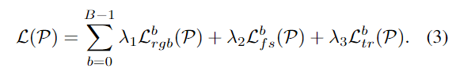

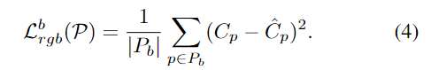

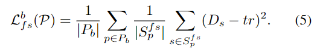

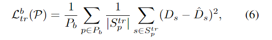

**采样策略：**采样点$S_p$主要分为两次。第一次在射线上**分层采样**$S_1$个点，通过MLP得到预测SDF，可以搜索到SDF零点即真实表面的粗糙估计；第二次在零点即**表面附近采样**$S_2$个点，使用这些点执行MLP的第二次前向传播。最后MLP的输出连接到第一次采样点的输出，在整合颜色时，使用所有的采样点。注意，在第一次采样时，采样率需要足够高，在截断区域内产生样本，避免错失零点。

实验中，截断距离$tr=5cm$，并将场景放缩，使得截断区域映射到$[-1,1]$，正数在表面前，负数在表面后。使用TensorFlow框架，ADAM优化器，$lr=0.0005$。损失权重$\lambda_1=0.1,\lambda_2=10,\lambda_3=6000$。迭代次数200000次，每次迭代优化选择$P_b$条射线。第二次采样点$S_2=16$，第一次平均每1.5cm射线长度采样一个点，实验中射线长度大概4-8m。Marching Cube的分辨率每格1cm。

## Experiments

**Datasets：**ScanNet，ICL-NUIM

**Baselines：**BundleFusion，RoutedFusion，COLMAP ，[Conv_onet](#Conv_onet (ECCV 2020))，SIREN，NeRF 

**Metrics：**Chamfer distance，IoU，normal consistency， F-score

  

# DirectVoxGO (CVPR2022)

>**Title：** Direct Voxel Grid Optimization: Super-fast Convergence for Radiance Fields Reconstruction
>
>**Paper：** [here](https://arxiv.org/pdf/2111.11215)
>
>**Code：** [DVGO (sunset1995.github.io)](https://sunset1995.github.io/dvgo/)

## Methods

在novel view synthesis领域中，NeRF是目前SOTA的方法。但是，NeRF及其变体往往需要几个小时到几天的训练时间，而且是在单一场景下。作者提出一种**加快收敛**的方法，只使用一个GPU的情况下，不到15min便快速收敛，而且性能上不亚于NeRF。作者使用density体素网格来表示场景几何*(explicit)*，用浅层网络与特征体素网格混合的方法来表示复杂的外观信息*(implicit)*。并且提出了两种方法可以加快收敛：1. 在体素density中引入了**post-activation interpolation**(先插值后激活)机制，可以在较低的网格分辨率下产生sharp表面；2. **Direct voxel grid optimization**容易产生几何次优解，作者引入了多个先验知识增强优化过程的鲁棒性。

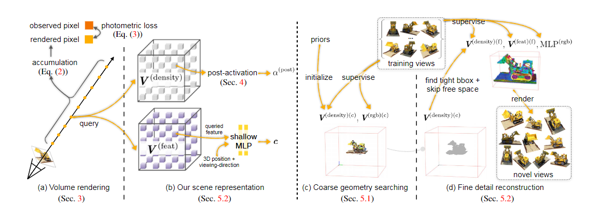

### Preliminaries

主要Pipeline和NeRF一致，主要通过MLP网络映射3D点$x$和视角方向$v$，得到相应的density $\sigma$和color $c$。$e$是一个中间层的embedding使得更浅层的color网络学习参数，输出的激活函数，$c$使用sigmoid函数，$\sigma$使用ReLU或Softplus。

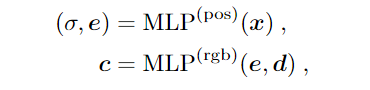

体渲染和[MonoSDF](#MonoSDF (2022))中类似，渲染出rgb后，通过最小化与真值之间的损失来训练NeRF模型。

### Post-activated density voxel grid

voxel grid的表示方法是显式的，可以通过插值高效地查询数值(density, color, feature)：

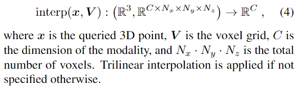

Density voxel grid的channel维度为1，在应用density激活函数前，我们用$\ddot{\sigma}$表示体素density。本文作者用shifted softplus作为density的激活函数，其中shift $b$是个超参数。使用Softplus而不用ReLU是至关重要的，因为使用ReLU时，当体素被设置为负值时，是不可修复的。而使用Softplus可以得到非常接近于0的density。

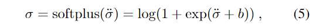

在体渲染中，得到的density $\ddot{\sigma}$要经过alpha和Softplus函数变换，作者考虑了3种不同次序的方法。经过相关实验证明，post-activation的方式可以用更少的grid产生更尖锐的表面。

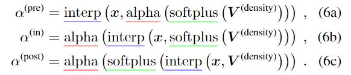

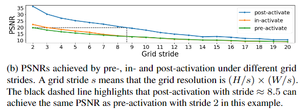

### Fast and direct voxel grid optimization

先搜寻场景的coarse几何细节，然后重建出fine细节包括依赖于视角的效果。

**Coarse geometry searching：**往往场景中大部分都是自由空间，即不被表面占用的空间。因此作者在fine阶段前，先找到感兴趣的coarse区域，这样大大减少了后期fine阶段每条射线上采样点的数量。粗糙场景的表示用一个coarse密度体素网格表示，颜色也用一个网格表示，通过插值查询density或color，激活函数使用post-activation。将整个场景视为一个BBox，根据coarse网格的尺寸，将BBox分为了$x*y*z$个grid。在渲染像素射线时，在最近点到最远点中采样。

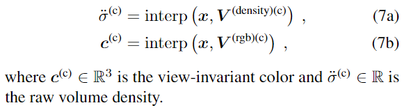

coarse阶段主要用两个先验知识：

1. low-density initialization。
2. view-count-based learning rate

**Fine detail reconstruction：**coarse网格在fine阶段冻结，我们用一个更高分辨率的density网格表示场景几何细节。颜色外观表示使用混合的方式，插值一个特征网格，得到$D$维度的特征向量，然后用一个浅层的MLP查询点$x$在视角方向$v$的color：


## Experiments

**Datasets：** Synthetic-NeRF，Synthetic-NSVF，BlendedMVS，Tanks&Temples，DeepVoxels

**Metrics：** PSNR，SSIM，LPIPS 


> **Thinking: **几何信息通过显式方法的density网格插值查询，外观信息通过混合方法feature网格和浅层MLP查询color，可以考虑这种结构来进行Mapping。或者单个MLP表示几何，混合表示外观。

## Cite

```
@inproceedings{SunSC22,
  author    = {Cheng Sun and Min Sun and Hwann{-}Tzong Chen},
  title     = {Direct Voxel Grid Optimization: Super-fast Convergence for Radiance Fields Reconstruction},
  booktitle = {CVPR},
  year      = {2022},
}
```


# Manhattan-SDF  (CVPR2022)

> **Title：** Neural 3D Scene Reconstruction with the Manhattan-world Assumption
>
> **Paper：** [here](https://arxiv.org/abs/2205.02836)
>
> **Code：** [Neural 3D Scene Reconstruction with the Manhattan-world Assumption (zju3dv.github.io)](https://zju3dv.github.io/manhattan_sdf/)

## Methods

先前的许多重建方法对于场景中无纹理区域重建效果较差，本文证明平面约束可以方便地集成到隐式方法中，通过平面约束整合到深度图估计可以解决上述问题。作者使用一个MLP表示场景几何的SDF信息，基于**曼哈顿世界的假设**，可以利用**平面约束**对2D语义分割网络预测的地板或墙壁几何区域进行正则化处理。为了解决分割不准确的问题，用另一个MLP对3D点坐标的语义信息进行编码，并设计了一个新颖的损失函数来**联合优化**场景几何和语义信息。


**Pipelines：**本文提出ManhattanSDF，给定室内场景的**带有相机位姿**的多视角**RGB图像**，来重建出高质量的场景几何并分割语义信息。为了学习场景的几何、外观和语义信息，我们用隐式神经表示的方法。对于图像的一个像素，通过MLP和体渲染技术渲染出像素的颜色和语义概率，通过输入的2D图像和语义标签监督学习。引入基于曼哈顿世界假设的平面区域几何约束，对几何信息和语义信息联合优化，提高了重建和分割的准确率。

### Learning scene representations from images

场景几何与外观信息用符号距离和颜色场表示。给定一个3D点$x$，通过MLP映射出**符号距离**$d(x)$，以及几何特征向量$z(x)$。通过计算符号距离$d(x)$在$x$的梯度可以得到法向量$n(x)$，将$x,n(x),z(x)$以及视角方向$v$输入MLP得到**外观信息**color。
$$
(d(x),z(x))=F_d(x) \\
c(x)=F_c(x,v,n(x),z(x))
$$
通过体渲染技术来渲染像素点，对像素点所对应的射线上采样多个点，预测出每个点的符号距离和颜色。体渲染过程和[MonoSDF](#MonoSDF (2022))中类似，将SDF转换为density，通过公式渲染出颜色color。

训练的时候，通过计算渲染的color与真值的L1$img$损失优化网络参数，并添加了Eikonal损失正则化。


除了计算图像颜色损失，作者还引入了深度损失，一定程度上提高了重建质量。由于本文没有使用RGB-D图像，所以采样像素点的真值depth通过多视角几何SFM计算得到，与渲染出的depth做L1损失帮助优化网络参数。

### Scene reconstruction with planar constraints

地板、墙壁这些平面区域往往都是无纹理区域，作者引入曼哈顿世界假设，室内场景中的地板和墙壁往往和XYZ主轴方向对齐，因此作者将几何约束应用于这些平面区域中。因此，作者使用了一个**2D语义分割网络**来获得地板墙壁区域，用损失函数使得平面区域内的点法线方向相同。

对于地板区域，根据曼哈顿假设，地板平面垂直于Z轴，对于地板区域的点设计出法线损失。其中$x_r$为相机射线与地板表面的交点3D坐标，$n(x_r)$是通过符号距离的梯度计算的法向量，$n_f=[0,0,1]$表示地板区域的假定法线方向。


对于墙壁区域，引入一个可学习的法向量$n_w$，设计损失函数使得墙表面上点的法线方向平行或正交于$n_w$。其中，初始化$n_w=[1,0,0]$，在训练期间，一起联合优化$n_w$和网络参数。固定$n_w$的最后一位为0，保证垂直于$n_f$。


因此，可以定出总的几何损失函数：


### Joint optimization of semantics and geometry

应用平面约束后可以显著提高重建质量，但是分割网络预测结果可能会出现错误，从而导致一些错误的重建。为了解决这一问题，作者提出联合优化3D语义标签和场景几何外观。

通过预测每个点的语义逻辑来增强场景表示，语义逻辑$s(x)=F_s(x)$可以通过MLP网络进行预测，再应用softmax函数，将语义逻辑转换为地板墙壁以及其他区域的概率。同样的，通过体渲染技术将语义逻辑渲染到2D图像空间。因此我们可以通过公式得到渲染后的语义逻辑，其中$s_i$表示采样点的逻辑。


得到渲染的语义逻辑后，通过softmax标准化计算出多类别的概率，$\hat{p}_f,\hat{p}_w,\hat{p}_b$分别表示地板、墙壁和其他区域的概率。因此我们可以将上述的几何损失函数改写为**联合损失函数**，联合优化地板墙壁的几何法线和语义信息。


为了防止语义分割的错误对重建造成影响，作者还引入了cross-entropy损失函数对语义分割结果进行监督，其中$\hat{p}_k(r)$是某一类别渲染的概率，$p_k(r)$是2D语义分割预测的结果。


下图表示使用各种损失函数的重建效果，可以看出联合优化的效果更佳。


本文使用Detectron2的DeepLabV3+来实现2D语义分割网络，图像resize到640*480用于分割与重建。使用PyTorch框架，ADAM优化器，学习率0.0005，每批次1024条射线，迭代50000次。最后使用Marching Cube从学习的SDF函数中提取表面mesh。

## Experiments

**Datasets：**ScanNet，7-Scenes

**Baselines：**

1. 经典MVS算法：COLMAP 

2. 拟合平面的MVS：COLMAP*

3. 平面正则化的MVS：ACMP

4. 体渲染的方法：NeRF，UNISURF，NeuS，VolSDF

**Metrics：**accuracy，completeness，precision，recall，F-score，IoU(用于语义分割)

## Cite

```
@inproceedings{guo2022manhattan,
  title={Neural 3D Scene Reconstruction with the Manhattan-world Assumption},
  author={Guo, Haoyu and Peng, Sida and Lin, Haotong and Wang, Qianqian and Zhang, Guofeng and Bao, Hujun and Zhou, Xiaowei},
  booktitle={CVPR},
  year={2022}
}
```


# GenDR (CVPR2022)

>**Title：** GenDR - The Generalized Differentiable Renderer
>
>**Paper：** [here](https://arxiv.org/abs/2204.13845)
>
>**Code：** [GenDR: A Generalized Differentiable Renderer (github.com)](https://github.com/Felix-Petersen/gendr)

## Cite

```
@inproceedings{petersen2022gendr,
  title={{GenDR: A Generalized Differentiable Renderer}},
  author={Petersen, Felix and Goldluecke, Bastian and Borgelt, Christian and Deussen, Oliver},
  booktitle={IEEE/CVF International Conference on Computer Vision and Pattern Recognition (CVPR)},
  year={2022}
}
```


# NeuralWarp (CVPR2022)

> **Title：** Improving neural implicit surfaces geometry with patch warping
>
> **Paper：** [here](https://arxiv.org/pdf/2112.09648.pdf)
>
> **Code：** [Improving neural implicit surfaces geometry with patch warping (enpc.fr)](http://imagine.enpc.fr/~darmonf/NeuralWarp/)

## Methods

现在神经隐式表面重建的方法精度有限，难以渲染出高频纹理。本文中在标准渲染优化的过程中添加一个不同视角的光度一致性项，优化了隐式几何信息。这种方法有两个关键要素：1. 利用预测的每条射线上采样点*occupancy和normal*，*warping整个patches*，并用鲁棒的SSIM*(structural similarity)*测量它们的相似性。2. 为了处理可见性与遮挡问题，对不正确的warp并不重视，同时尽可能地完成重建。


**Approach：**结合了体渲染和patch warp技术


### Volumetric rendering of radiance field

场景信息通过两个神经网络表示，geometry网络编码出场景的SDF几何信息，radiance网络编码出空间中任何点向各个方向发射出的颜色信息。假定一张参考图像$I_r$，对于像素点$p$，计算计算渲染颜色与真值颜色的L1损失来优化两个网络。体渲染过程基本都相似，沿射线采样$n$个点，经过**geometry网络**得到每个采样点的法向量$n_i$和SDF值，为了渲染颜色还需将SDF转换为occupancy $\alpha_i$。再将点坐标、法向量和射线方向输入**radiance网络**，得到每个采样点的radiance $c_i=c(x_i,n_i,d)$。然后通过加权求和的方式渲染出像素点的color。但是，这类方法的重建效果总是不如传统MVS方法，作者猜测是radiance网络难以表示高频纹理的原因。


### Warping images with implicit geometry

假定一张参考图像$I_r$和一张源图像$I_s$，我们想用**geometry网络**预测的occupancy和*从**源图像投影**的颜色*来渲染像素$p$或者$p$所在patch的color。


**Pixel warping：**首先解释源图像是如何逐像素warp到目标图像的，这一过程称之为pixel warping。假定空间中任一点都可以投影到源图像中，源图像与参考图像形成了**对极几何**，因此在参考图像中像素点所在的射线上所采样的每个点都可以投影到源图像的**极线**上，即可通过在源图像上插值得到每个采样点投影的颜色。作者从源图像中定义像素点$p$的**warp值**$W_s[p]$，该公式和上述体渲染颜色公式类似，其中$I_s[\pi_s(x_i)]$表示采样点在源图像投影所插值的颜色值。


如果同样使用$W_s[p]$与真值$I_r[p]$的L1损失进行优化geometry网络，可能会在重建中导致artifact，而且这不能模拟出与视角相关的强度变化，比如反射。因此，作者提出更鲁棒的基于patch的光度损失函数。

**Patch warping：**将一个点视为**面块(patch)**的方法在MVS中很常见，如PMVS。根据对极几何，我们求出单应性矩阵$H_i$，这样给出参考图像的任一像素$p_r$，都可以求出其对应源图像的像素坐标$H_i*p_r$。单应性矩阵是一个3*3的矩阵，可以由下列公式求解，其中$n_i$表示每个采样点的法向量，可以通过geometry网络得到。


通过对上述公式进行改进，可以把pixel拓展到patch。将单应性矩阵应用于patch中所有的像素，即可得到参考图像patch $P$在源图像中patch的位置$H_i*P$。因此可以得到patch的warp值$W_s[P]$：


### Optimizing geometry from warped patches

我们想要定义一个基于warped patch的损失函数优化几何网络，但是没那么简单。因为实际情况下参考图像上的采样点并不一定会投影在源图像上，可能出超出图像尺寸，投影在图像外。本文使用这样的方法：*如果一个patch投影到图像外，那么就用原来的patch填充投影后的patch*。因为渲染是加权求和的方法，离表面越近权重越大。当投影无效的3D点都不在表面附近，那么填充的patch影响就比较小；反之，如果表面附近的点都是无效点，那么影响较大。

**Validity masks：**为此，作者给参考图像的patch设定一个0-1的mask值，来判断是否有效。在定义mask时，作者考虑了两种mask：一个是几何原因导致无效的投影mask，一个是源图像中场景遮挡导致的遮挡mask。最后的mask定义为这两种mask的乘积$M_s[P]=M_s^{proj}[P]*M_s^{occ[P]}$.

对于**投影mask**，作者引入了一个二指标$V_i^s$，如果无效则为0，反之为1。判断patch无效有以下3个因素：第一，投影点在源图像外；第二，参考图像与原图像在采样点法向量所定义平面的两边；第三，相机中心离采样点法向量所定义的平面太近。对于这三种，定义$V_i^s=0$。通过对射线上采样点的指标加权求和可以得到投影mask$M_s^{proj}[P]$：


对于**遮挡mask**，检查在点$x$与源图像相机中心之间是否有遮挡区域。作者在源图像相机中心与采样点$x_i$的连线上采样$N$个点，通过geometry网络计算出每个点的occupancy $\alpha^s$，因此可以计算出每个采样点对于源图像相机中心的透光率$T_s(x)=1-\prod_{k=1}^{N}(1-\alpha_k^s)$。如果采样点$x_i$不被遮挡，则$T_s(x_i)$接近于1。由于计算所有采样点的透光率较麻烦，作者选择只计算与表面交点的$T_s$，并以此计算遮挡mask：


**Warping-based loss：**有了mask后，构造损失函数。其中$d(I_r[P],W_s[P])$表示参考图像patch的颜色与源图像warped patch的光度距离，本文用SSIM计算：


### Optimization details

**Full optimization：**通过最小化**vol损失和warp损失**来优化geometry和radiance网络参数，同时添加了**Eikonal正则化**，最终总的损失函数如下：


其中，$\lambda_{vol}=1,\lambda{eik}=0.1$。在初次优化网络时，$\lambda{warp}=0$，在100000次迭代后，学习率由0.0005指数衰减到0.00005。然后在另外的50000次迭代中，$\lambda_{warp}=1$，学习率固定为0.00001。网络参数使用sphere初始化，一开始只优化体渲染，因为法线噪声太多，无法计算有意义的单应性矩阵。每批次采样1024个像素用于训练。

**Architecture：**geometry网络是8层的MLP，每层256维度。radiance网络是4层的MLP，每层256维度。对于3D点坐标采用频率为6的位置编码，对于视角方向$d$采用频率为4的位置编码。

**Rays sampling：**参考自VolSDF，首先使用算法估计不透明度，在不透明度分布上采样90%的64个点，其余的10%在射线上均匀采样。

**Choice of source images：**参考自COLMAP，源图像一组19张。首先使用SFM软件构造一个稀疏点云，然后计算每个图像共同可见稀疏点的个数，并通过三角形去除掉一些点，最终选择19张图像。

## Experiments

<font color=red size=4>object-level reconstruction</font>

**dataset：**DTU，EPFL

**baselines ：**IDR ，COLMAP ，UNISURF ，MVSDF ，VolSDF ，NeRF ，NeuS 

## Cite

```
 @inproceedings{
            author    = {Darmon, Fran{\c{c}}ois  and
                         Bascle, B{\'{e}}n{\'{e}}dicte  and
                         Devaux, Jean{-}Cl{\'{e}}ment  and
                         Monasse, Pascal  and
                         Aubry, Mathieu},
            title     = {Improving neural implicit surfaces geometry with patch warping},
            year      = {2022},
            booktitle = CVPR,
          }
```


# NeRFusion (CVPR2022)

> **Title：**NeRFusion: Fusing Radiance Fields for Large-Scale Scene Reconstruction
>
> **Paper：**[here](https://arxiv.org/abs/2203.11283)
>
> **Code：**[NeRFusion: Fusing Radiance Fields for Large-Scale Scene Reconstruction (jetd1.github.io)](https://jetd1.github.io/NeRFusion-Web/)

## Methods

NeRF虽然在神经重建与渲染领域取得了很大的成功，但由于MLP容量有限，每个场景优化时间太长，导致重建大型室内场景有很大挑战。而经典的3D重建方法可以处理大型场景但不能产生现实的渲染效果。作者提出NeRFusion，结合了**NeRF和基于TSDF fusion**的优势，可以高效实现大型室内场景重建和真实感的渲染。对于输入的图像序列，通过网络直接预测每帧的局部radiance，然后使用一种新颖的**循环神经网络(RNN)**，可以增量式重建出全局的稀疏场景表示，并且帧率达到实时22FPS，这个全局体积融合可以进一步微调提高渲染质量。NeRFusion在大型室内场景和小型物体场景都可以实现SOTA的重建质量，与其他方法相比，重建速度大大加快。


**Pipeline：**给定一序列有位姿的图像序列，首先通过2D的CNN提取图像特征。然后对于每一帧，通过使用一个稀疏的3D CNN网络在可视的体素上抓取并聚合相邻视角的2D特征，从而在世界坐标中重建一个局部稀疏的神经volume。接着进一步使用RNN跨帧融合稀疏的局部volume，并建立全局的特征volume来模拟整个场景的radiance field。最后从稀疏神经volume中回归出density和视角相关的radiance，使用可微分的ray marching渲染图像。

### Sparse Volumes for Radiance Fields

输出的radiance field是由一个稀疏的神经volume建模而成的，每个体素中保存着该体素的神经特征。首先在稀疏的神经volume中三线性插值得到在3D坐标$x$处的特征向量$\mathcal{V}(x)$，然后通过MLP网络回归出density $\sigma$和视角方向$v$上的radiance值$c$。该MLP网络$R$在训练过程中对于所有volume都是共享的。
$$
\sigma,c=R(x,d,\mathcal{V}(x))
$$

### Reconstructing Local Volumes

作者提出了一个深度神经网络，对每一帧t，使用其图像$I_t$和相邻视角中的$K-1$张图像回归出局部的神经volume。使用多张相邻视角的图像可以使得网络更好的重建场景几何。为了使每帧的局部重建可以更泛化性跨场景，作者使用MVS技术。从图像中提取2D特征并构建了一个cost volume，从中回归出神经特征volume。作者在世界坐标系下构建volume，使其与最终的全局volume对齐，便于后续的融合过程。

**Image feature extraction：**作者使用一个深度2D CNN网络对每一个输入帧提取2D特征，将输入图像$I_t$映射为2D特征图$F_t$。

**Local sparse volume：**作者使用包含世界空间中一组体素的边界框，来表示$K$个相邻视角的视角锥体所覆盖的范围。包围框与世界坐标对齐，包围框内的体素可以被相邻视角所看到，并掩盖了对所有视角都不可见的体素，导致稀疏的体素集合。然后将2D图像特征反投影到volume进行局部重建。

**3D feature volume：**对于当前帧t的每一个相邻视角$i$和对应的特征图$F_i$，建立一个3D特征volume $\mathcal{U}_i$。特别地，对每一个可视的体素$v$，抓取每一个相邻视角在当前帧t投影的2D特征向量$F_i(u_i)$，$u_i$表示每一个视角$i$的投影坐标。并且利用每一相邻视角到$v$的视角方向$d_i$，用一个MLP网络$G$计算出额外的特征向量$G(d_i)$，连接到$F_i(u_i)$。最终可以得到每个视角的3D特征volume $\mathcal{U}_i$，其中每个体素$v$的特征值为$\mathcal{U}_i(v)=[F_i(u_i),G(d_i)]$。

**Neural reconstruction：**将当前帧t的多个相邻视角的特征volume聚合回归出一个局部volume $\mathcal{V}_t$，来表示局部的radiance场。作者计算出所有相邻视角的$\mathcal{U}_i$的平均值和方差，平均值可以融合出每个视角下的外观信息，方差为几何信息提供相应的线索。使用一个深度神经网络$J$来处理每个体素特征的平均值和方差，来回归出当前帧t的重建volume $\mathcal{V}_t$。


### Fusing Volumes for Global Reconstruction

为了重建出连续的、高效的、可扩展的场景，使用全局的神经融合网络增量式融合每帧的局部特征volume$\{\mathcal{V}_t\}$，形成一个全局的volume $\mathcal{V}^g$。


**Fusion：**对于当前帧t，将其局部稀疏的volume重建$\mathcal{V}_t$和先前帧的全局重建$\mathcal{V}_{t-1}^g$作为循环的输入。在融合模块中使用了**GRU(Gated Recurrent Unit)**和稀疏3D CNN网络，使得网络能够循环融合每帧的局部重建信息，输出高质量的全局radiance场。


此为GRU模块的具体实现，其中*\**表示矩阵对应元素的相乘，$z,r$分别为更新门和重置门，$M_z,M_r,M_t$都是神经网络的稀疏3D卷积层和标准的GRU一样，$M_z,M_r$使用sigmoid函数，$M_t$使用tanh函数。在该过程，只在局部volume$\mathcal{V}_t$覆盖的体素上应用网络，全局volume的其他体素保持不变。更新门和重置门可以决定先前的全局信息和当前的局部信息应该怎么融合到新的全局信息，因此，该模块可以在表示场景一致性时，填充空洞并改进特征，自适应性提高了场景表示的质量。


  **Voxel pruning：**为了最大化内存和渲染效率，作者移除了一些没有任何场景内容的体素，自适应修改每一帧的全局volume $\mathcal{V}_t$。利用辐射场回归每个体素的density，通过下式来判断是否移除该体素。其中，$\{v_i\}_{i=1}^k$表示在体素$V$中均匀采样的点，$\sigma(v_i)$表示预测的density，$\gamma$是修改阈值。这个修改步骤在训练和推断时，一旦得到一个全局特征volume $\mathcal{V}_t^g$，就执行一次。这样做可以使得全局volume更稀疏，高效重建渲染。


### Training and optimization

首先，通过最小化使用当前帧局部volume $\mathcal{V}_t$渲染像素颜色与真值的L2损失，优化局部的重建网络和辐射场网络$R$。使得网络学会预测合理的局部volume，并能够渲染产生真实的局部图像，也可以初始化辐射场MLP网络$R$合理的状态。这个预训练过程可以有效地促进融合模块的完成。


然后，使用一个渲染损失来优化训练所有的局部重建网络、融合网络和辐射场网络。其中$C_t$是使用局部重建$\mathcal{V}_t$所渲染的，$C_t^g$是使用融合当前帧t后的全局volume $\mathcal{V}_t^g$所渲染的颜色。通过训练后，整个网络可以直接推断输出高质量的辐射场，产生逼真的渲染结果。重建的辐射场还可以进一步微调，提高渲染质量。

**Fine-tuning：**为了微调预测的辐射场，优化了$\mathcal{V}^g$每个体素的神经特征，以及每个场景的MLP，从而获得更好的渲染结果，并且不会花费太长时间。

**Training datasets：**大型室内场景的ScanNet，DTU和Google Scanned Objects的小物体

**Training details：**对于每一个输入图像序列均匀采样关键帧，作为网络训练的输入帧。对于物体级数据集，采样16个视角图像；对于场景级，采样全部序列的2%~5%作为关键帧。相邻视角图像选择$K=3$。选择ADAM优化器，学习率0.003。

## Experiments

**Baselines：**NeRF，NVSF，NerfingMVS，PixelNeRF，MVSNeRF ，IBR-Net

**Datasets：**ScanNet，DTU

## Cite

```
@article{zhang2022nerfusion,
        author    = {Zhang, Xiaoshuai and Bi, Sai and Sunkavalli, Kalyan and Su, Hao and Xu, Zexiang},
        title     = {NeRFusion: Fusing Radiance Fields for Large-Scale Scene Reconstruction},
        journal   = {CVPR},
        year      = {2022},
      }
```


# Neural Kernel Fields (CVPR2022)

> **Title：**Neural Fields as Learnable Kernels for 3D Reconstruction
>
> **Paper：**[here](https://arxiv.org/abs/2111.13674)
>
> **Code：**[Neural Fields as Learnable Kernels for 3D Reconstruction (nv-tlabs.github.io)](https://nv-tlabs.github.io/nkf/)

## Methods

作者提出*Nerual Kernel Fields(NKF)*，一种基于学习的kernel ridge回归的隐式3D重建方法。从几个稀疏的定向点云重建3D物体或大型场景，NKF可以实现SOTA的结果，并且可以重建出训练集类别外的物体形状，精度也几乎不会降低。该方法的重要思想是，当选择的核具有合适的归纳偏置，对于重建形状是非常有效的。该方法将重建问题分为了两部分：一个骨干神经网络，用于从数据中学习核参数；核ridge回归使用学习的核通过解决一个简单的正定系统，来快速拟合输入的点。该重建方法在稀疏点下有着数据驱动方法的优点，同时保持插值行为，随着输入的采样点密度增加，逐渐收敛到真值的形状。并且有着很强的泛化能力，可以在训练集外的类别下重建物体。


**Pipeline：**主要分为两个阶段，Prediction从输入的点云中预测一个隐式函数，Evaluation来验证这个隐式函数。其中预测的函数包括一个特征函数$\phi$和一组系数$\alpha$。

### Review of Neural Splines

对于一组3D点$X$以及法向量$N$，找到一个隐式函数$f$表示完整的表面信息，也就是说，这些输入点应该输出为0并且梯度等于法向量，因此可以最小化一个简单的损失函数来找到$f$。其中梯度部分也可以换种方式表达，数据增强得到3组点，来计算损失。为了最小化，将$f$表示为输入点核偏置的加权求和，其中$\alpha$为系数，可以通过线性求解。$K_{NS}$是一个浅层ReLU神经网络的封闭解，依赖于输入点齐次坐标的内积。


其中Neural Spline核函数定义为


### Inductive Bias of Neural Splines

Nerual Spline的核公式给归纳偏置*(inductive bias)*做了个明确的概念，线性解不受输入点的约束。上述线性系统的解也就是下列约束优化问题的最优解，其中最小化的范数$||f||_K$定义了核方法的归纳偏置，这使得函数不受约束。约束$f(x_j)=y_j$保证了优化问题的任意解都可以将输入的数据插值到正则化器$\lambda$所定义的范围。


归纳偏置对于重建表面有着非常平滑的效果，但在具有挑战性的情况下，当输入点只覆盖形状的一部分时，这种归纳偏置的先验知识不够强。NKF使用依赖于数据的kernel，以输入数据为条件学习到较合适的归纳偏置，用这种kernel解决上述的线性系统，保证了输出的形状依赖于输入点。

### Neural Kernel Fields

NKF模型基本遵循于上述的Nerual Spline，给定一组在表面形状采样点$X$和法向量$N$，然后数据扩充到$2\mathcal{S}$个点，同时得到对应的labels $y$。该方法只用了表面内和表面外的点，没有用到表面上的点，$X^{'}=X^+\cup X^-$，模型总的输入可以表述为$\mathcal{X}=(X^{'},y)$。

**Data Dependent Kernel：**首先需要用每个点的特征向量$\phi(x,\theta)$连接到3D点坐标来拓展输入数据维度，$\phi$是参数为$\theta$的特征神经网络。用每个点学习的特征来定义依赖点的内核$K$，其中$K_{NS}$为Neural Spline内核函数。


网络$\phi$的结构和[Conv_onet](#Conv_onet (ECCV 2020))类似，将输入的点云离散化一个$M*M*M$小格的volume，在每个包含输入点的小格使用PointNet来提取格子中的特征。然后将特征向量传入全卷积的3D U-Net，最终产生$M*M*M*d$的特征网格。使用三线性插值的方法得到每个输入点的特征向量。

**Predicting an Implicit Function：**为了预测隐式函数，通过解决$2\mathcal{S}*2\mathcal{S}$正定矩阵的线性问题，来找到每个输入点的系数$\alpha$：


**Training the Model：**为了训练模型，使用了一些物体形状的数据集。每一个形状数据集包含输入点与标签$\mathcal{X}=(X^{'},y)$、包含形状的volume中一组稠密的点集和占有率标签$X_{vol},Y_{vol}$、和形状表面上的一组稠密点集$X_{surf}$。其中这两组稠密点集只在训练中用于监督，占有率标签表示点在表面的内部或外部。

为了训练网络$\phi$，首先使用输入的$\mathcal{X}=(X^{'},y)$预测一个隐式函数，然后在稠密的点集$X_{vol},X_{surf}$上验证，通过下面损失函数计算损失。第一项计算BCE损失使得预测的函数有正确的占有率，第二项保证表面上的点接近真值。然后梯度反向传播更新$\phi$网络参数，哦那个人更好地学习公式(8)中依赖点的内核$K$。


**Learning to Denoise：**通过有选择地预测每个点的权重，使重建对噪声更具鲁棒性。使用一个全连接网络$w_j=\rho(\phi(x;\theta);\theta_w)$将每个点的输入特征映射到权重信息。然后通过下式而不是公式(9)，解决一个加权的ridge回归问题，其中$W=diag(w_1,...,w_s)$是一个对角矩阵，对角线上是每个输入点的权重。在有噪声的影响下，加权重建相对于不加权效果更好。


## Experiments

单物体重建、形状完成、类别外的泛化性、场景重建、点云密度泛化性

**Datasets：**ShapeNet ，ScanNet

**Baselines：**OccNet，[Conv_onet](#Conv_onet (ECCV 2020))，SPSR，Neural Splines，LIG ，NS

**Metrics：**IoU，L2 Chamfer Distance，Normal Correlation

## Cite

```
@misc{williams2021nkf,
                title={Neural Fields as Learnable Kernels for 3D Reconstruction}, 
                author={Francis Williams and Zan Gojcic and Sameh Khamis and Denis Zorin
                        and Joan Bruna and Sanja Fidler and Or Litany},
                year={2021},
                eprint={2111.13674},
                archivePrefix={arXiv},
                primaryClass={cs.CV}}
```


# POCO (CVPR2022)

> **Title：**POCO: Point Convolution for Surface Reconstruction
>
> **Paper：**[here](https://openaccess.thecvf.com/content/CVPR2022/papers/Boulch_POCO_Point_Convolution_for_Surface_Reconstruction_CVPR_2022_paper.pdf)
>
> **Code：**[valeoai/POCO (github.com)](https://github.com/valeoai/POCO)

## Methods

从点云重建表面在隐式表示方法取得了很大的成功，但是现有的方法大多面临着可拓展性问题。为了克服这一局限性，一些方法在粗糙的3D网格上推断潜在向量，通过插值得到要查询的占有率。然而，这种方法失去了与物体表面采样点的直接联系，在空间中均匀采样而不是在最重要的表面附近采样。本文提出了使用**点云卷积**的方法，计算每个输入点的潜在向量，然后使用推断的权重在最近的邻域进行**基于学习的采样**。


**Approach：**给定一组输入的表面上采样的3D点，可能会有噪声点，然后为每一个输入点创建一个潜在向量编码。为了估计出空间中查询点的占有率，在点的邻域中带权重插值出相对的占有率分数。最后使用Marching Cube对查询的占有率重建出mesh。


**Goal：**输入一组表面采样的3D点，重建出一个连续的隐式函数，给定任意一个点，都能计算出占有率。通过神经网络使用在空间中采样的点云数据来学习这个函数，然后可以将形状的表面提取为occupancy level为0.5的隐式函数等值面。

**Overview：**

1. 通过点云卷积的编码器$E$将每个输入点$p\in \mathcal{P}$编码为潜在向量$z_p=E(p)$.

2. 给定任意查询点$q$，考虑其在输入点中的邻域$\mathcal{N}_q$的$k$个点去插值。

3. 对每一个邻域点$p\in \mathcal{N}_q$，从其潜在向量$z_p$和相对$q$的局部坐标$q-p$去构造一个相对潜在向量$z_{p,q}$.

4. 提取权重$s_{p,q}$对每个邻域点的相对潜在向量$z_{p,q}$进行加权求和，得到$q$的潜在向量$z_q=\sum_{p\in \mathcal{N}_q}s_{p,q}z_{p,q}$.

5. 对特征向量$z_q$解码得到一个0或1逻辑，再将其转换为占有率$o_q$.

**Absolute encoding：**点云卷积解码器可以由任何一个点云分割的主干网络实现，只需将最后一层向量的维度改为$z_p$的维度。在实验中，选择FKAConv作为卷积主干网络，维度大小$n=32$。

**Query neighborhood：**在训练时，给定任意查询点$q$，从输入的点云中构造一组邻域点集，$\mathcal{N}_q$由$q$附近最近的$k$个点组成，实验中$k=64$。

**Relative encoding：**扩充的向量编码由每个邻域点的潜在向量$z_p$和相对坐标$q-p$连接组成，实验中将扩充的向量通过一个MLP网络$R$去产生相对潜在向量$z_{p,q}=R(z_p||q-p)$，$z_p.z_{p,q}$的尺寸大小都是32维度。

**Feature weighting：**我们观察到$z_{p,q}$的范数与其权重相关联，说明输入点$p$可以决定$q$的占有率。本实验使用注意力机制来推断出相对潜在向量$z_{p,q}$的权重。$z_{p,q}$通过一个网络权重为$w$，维度大小同样为$n$的线性层，得到相对权重$w_{p,q}=w\odot z_{p,q}$。实际上采用多头策略，使用了$h$个独立的线性层，对应$h$个权重向量$(w_i)_{i=1...h}$，产生$h$个相对权重$w_{p,q,i}=w_i\odot z_{p,q}$，最终经过softmax得到$s_{p,q,i}$，并取平均得到最后的权重$s_{p,q}$。实验中，$h=64$。

**Interpolation：**通过在邻域点的相对潜在向量$z_{p,q}$插值得到$q$的特征向量$z_q$，采用加权求和的方式$z_q=\sum_{p\in \mathcal{N}_q}s_{p,q}z_{p,q}$。

**Decoding：**线性层解码器$D$将特征向量$z_q$解码为占有分数$o_q=D(z_q)$，这是一个二逻辑向量，将$q$是否占有作为分类，最后通过softmax转换为占有率$o_q$。

**Loss function：**为了训练网络，选择交叉熵损失。

## Experiments

**Datasets：**ShapeNet，Synthetic Rooms，ABC，Famous，Thingi10k，SceneNet，MatterPort3D

**Baselines：**LIG，IF-Net，NDF，SG-NN，ConvONet ，AdaConv，RetrievalFuse ，Points2Surf，SPR 

**Mesh generation：**使用Marching Cube算法，物体重建使用分辨率$256^3$的网格，SceneNet网格尺寸1cm，MatterPort3D网格尺寸2cm。

**Metrics：**IoU，Chamfer L1-distance，normal consistency， F-Score

## Cite

```
@InProceedings{Boulch_2022_CVPR,
    author    = {Boulch, Alexandre and Marlet, Renaud},
    title     = {POCO: Point Convolution for Surface Reconstruction},
    booktitle = {Proceedings of the IEEE/CVF Conference on Computer Vision and Pattern Recognition (CVPR)},
    month     = {June},
    year      = {2022},
    pages     = {6302-6314}
}
```


# RegSDF(CVPR2022)

> **Title：**Critical Regularizations for Neural Surface Reconstruction in the Wild
>
> **Paper：**[here](https://arxiv.org/abs/2206.03087)

## Methods

现有的神经隐式方法在重建无边界或复杂的场景时，仍然存在时间复杂度过高、鲁棒性较差的问题。本文提出RegSDF，表明适当的点云监督和几何正则化可以有效产生高质量鲁棒性的重建结果。RegSDF以有方向的点云作为输入，使用可微分渲染器来优化用于几何表示的**符号距离场**和用于外观表示的**表面光场**。主要介绍优化部分的两个关键正则化，首先是**Hession正则化**，可以在有噪声或者不完整输入的情况下，将符号距离值平滑扩散到整个距离场；第二是**最小表面正则化**，可以对缺失的几何信息进行有效补充，对空洞部分进行插值，对缺失部分进行推断。

### Geometry and Appearance Representations

**几何表示：**density field, occupancy field, signed distance field

**外观表示：**radiance field, surface light field

本文选择SDF和表面光场表示场景的几何与外观。将表面$\mathcal{S}$定义为SDF函数的zero-level，其中SDF函数$f$可以通过一个网络参数为$\theta$的MLP表示。并定义场景的边界框范围$\Omega$，将空间中任意点$x\in \Omega$作为输入，输出点位置到最近表面的距离。表面可以表示为：
$$
\mathcal{S}=\{x\in \Omega |f(x;\theta)=0\}
$$
外观信息由表面光场表示，通过另一个网络参数为$\phi$的MLP网络$g$实现。将表面上的交点$x$和单位法向量$n$以及视角方向$v$作为输入，输出RGB颜色$c=g(x,n,v;\phi)$。其中法向量可以从SDF自动求微分得到，$n=\nabla _xf(x;\theta)$。

交点$x$可以使用球形追踪算法获得，但这对网络参数$\theta$是不可导的。作者构造了可微分的求交点算法。给定当前的SDF网络参数$\theta _0$，视角方向$v$和交点$x_0$，可微分的表面交点可以推导为：


### Data Term

本文以MVS网络得到的有方向点云作为输入。首先通过Vis-MVSNet生成无法线的点云，利用主成分分析法对每个点的邻域估计出法线，并根据相机位置对法线进行对齐，从而得到有方向的点云。

**Surface points：**输入的点云即物体或场景表面上的点，所以它们的SDF值应该为0，法向量应该与输入一致。让$x_D\in \mathcal{D}$作为输入的点，$n_D$为其法向量，因此可以得到输入数据点的损失，其中$\lambda _d,\lambda _n$分别为距离项和法线项的权重：


**Boundary：**我们还希望获得离表面很远的距离，如相机位置距离表面的距离，相机位置通常位于自由空间中，它的距离符号可以很好确定，一般都是位于表面外部。如果相机位置在所界定的范围框$\Omega$外，则考虑相机射线与$\Omega$的第一个交点作为边界点$x_B\in \mathcal{B}$。对于每一个边界点$x_B$，找到输入点云中最近的邻域点$x_B^{nn}\in \mathcal{D}$及其法向量$n_B^{nn}$。边界点$x_B$与最近的点$x_B^{nn}$之间的距离可以推导出，从而可以求得边界损失$L_B$，即$f(x_B)$与$d(x_B)$之间的L1损失。


### Regularization

每次迭代优化过程中，从范围框内均匀采样点$x_R\in \mathcal{R} \subset \Omega$，并作下列正则化。

**The gradients：**梯度的大小主要由Eikonal等式决定，$||\nabla f(x)||=1$。对于符号距离场，Eikonal损失期望空间中梯度的大小等于1，可以定义为所有样本点的求和并归一化：


我们希望空间中二阶导数处处存在，因此可以用Hession矩阵$H$定义二阶导数损失：


这种正则化会有两种作用：首先，通过输入点云适当监督学习的SDF值可以扩散到整个空间中，因此可以得到离表面很远的正确SDF值，可以通过插值解决输入的不完整问题；其次，对输入的数据点进行光滑处理，避免对噪声产生过拟合。

**The minimal surface：**Hession损失倾向于保留表面的法线，并将表面拓展为平面，如图中蓝色所示。若缺失的表面不是平面时，会造成错误。我们希望得到的表面区域面积最小，以至于插值或推断能更加紧凑。最小表面约束将会导致下图红色的结果，通过实现对两种正则化结合的插值可以得到较好的结果。


隐式表面的面积可以通过下述公式进行计算，其中$H$为Heaviside函数，$\delta$为Dirac函数。因为$f$是SDF函数，其中$||\nabla f(x)||=1$可以直接省略。


实际上，作者使用正则化的Dirac函数$\delta _\epsilon$，并用Monte Carlo方式计算积分，由此可得到最小表面损失。实验中，将控制峰值锐度的参数设置为$\epsilon =10$.


### Differentiable Rendering

和大多可微分渲染方法相似，对输入图像重新渲染并最小化其损失。每次迭代，随机采样多个像素点$p$，及其颜色真值$\hat{c}_p$。对于每一个像素点，首先通过**球形追踪**算法沿着视角方向$v_p$找到和表面的交点$x_p^{rt}\in \mathcal{S}$；然后对$f(x_p^{rt})$求导计算法向量$n_p^{rt}$，并通过上述公式(2)计算出可微分的表面交点$x_p^{rt}(\theta)$；最后通过表面光场$g$获得渲染的颜色，并可以计算出渲染损失。渲染损失可以联合优化几何与外观网络参数，可以恢复表面细节并修正插值的表面。


## Experiments

**Point cloud generation：**用预训练的Vis-MVSNet生成点云，通过Open3D的PCA算法计算出法线，最后下采样点云，使其密度均匀，密度距离为原始的90%。

**Network architecture：**用一个8层的MLP表示SDF，每层512维度，中间使用跳跃连接。一个相似结构的4层MLP表示表面光场。对点坐标进行6个八度的位置编码，对视角方向进行4个八度的位置编码。SDF网络额外输出256通道的位置描述符，并随后输入表面光场网络。

**Loss weights：**对上述所有的损失进行加权求和。


**Training：**网络训练batch-size大小为8，对DTU和BlendedMVS每个场景迭代1800epoch，对Tanks and Temples每个场景迭代600epoch。初始学习率为0.001，随后适当减小。

**Baseline：**sPSR，SSD，NeRF ，UNISURF ，NeuS ，VolSDF，IDR ，MVSDF ，SIREN

**Datasets：**DTU，BlendedMVS，Tanks and Temples


# BNV-Fusion (CVPR2022)

> **Title：**BNV-Fusion: Dense 3D Reconstruction using Bi-level Neural Volume Fusion
>
> **Paper：**[here](https://arxiv.org/pdf/2204.01139)

## Methods

基于TSDF-Fusion的稠密3D重建方法取得了很大进展，但TSDF体积表示对噪声的鲁棒性和保持细节水平之间难以维持平衡。本文提出Bi-level Neural Volume Fusion(BNV-Fusion)，该方法结合神经隐式表示和神经渲染的最新进展，可以实现**高质量在线**三维重建。给定一组深度图及其对应的相机位姿，新颖的双层融合策略可以深度图**增量式**集成到全局神经隐式表示中，提升了重建的质量和效率。

BNV-Fusion的创新之处在于结合了**局部融合和全局融合**。在局部层次，一个新的深度图首先映射为潜在编码，表示潜在空间的局部几何信息，然后通过加权平均融合到全局神经表示中。但是，局部融合易受深度异常点影响，导致不正确的几何信息。最后使用神经渲染来优化全局表示，通过计算从神经隐式体积提取SDF与深度测量结果的差异，来优化全局几何信息。局部融合和全局融合是互补的，局部融合可以有效地融合新的几何信息并初始化全局几何信息，而全局融合能够显著的提升重建质量。


**Pipeline：**给定一序列深度图$\{D_0,...,D_n\}$以及对应的相机位姿$\{T_{c0}^w,...,T_{cn}^w\}$，表示相机到世界坐标系的转换矩阵。BNV-Fusion通过一个全局的隐式神经体$V_w$表示场景的几何信息。对于当前帧t，首先将深度图$D_t$映射为单视图神经体$V_{ct}^s$，其中每个体素包含一个潜在编码，表示潜在空间的局部几何信息。然后通过bi-level fusion将单视图神经体$V_{ct}^s$使用平均加权$W_{ct}^s$的方式整合到全局神经体$V_w$。在全局融合过程中，通过最小化神经体解码的SDF与真实测量SDF之间的差异，来迭代优化全局神经体。

### Implicit Neural Volume

隐式神经体$V=\{v=(p,l\}$，表示每一个体素$v$包含它所在的位置$p$，和隐式表示局部几何信息的潜在编码$l$。为了从神经体中恢复一个3D点$x$的SDF值，首先检索神经体中8个邻域体素，并将$x$转换为相对每个邻域的相对坐标$\bar{x}_i=x-p_i$。使用一个形状解码器$\mathcal{D}$对8个邻域的潜在编码和相对坐标解码预测出$x$的SDF值，其中$w$是三线性插值的权重。得到预测的SDF后，便可使用Marching Cube算法提取场景几何模型mesh。


### Learning the Local Shape Embedding

隐式表示几何的关键是数据驱动的局部形状嵌入，作者使用AutoEncoder类似的网络进行学习。根据PointNet改进了一个深度编码器$\varepsilon$，将由深度图反投影的点云作为输入，通过聚合局部区域的信息来提取每个点的深度特征。这些特征映射到一组潜在编码，通过4层全连接的MLP解码器$\mathcal{D}$得到预测的SDF值。

**Training：**使用ShapeNet的CAD模型来监督训练编码器$\varepsilon$和解码器$\mathcal{D}$。给定一组训练样本，$p$是局部表面上一组有法线的局部点云，$x$是在表面上采样的样本点，及其SDF真值$s_x^{gt}$。从而可以得到L1损失函数：


**Inference：**在当前帧t，深度图$D_t$首先通过相机参数信息反投影出3D点云，然后将点云分割为重叠的局部点云$\{p_0,...,p_n\}$，每一个局部点云通过编码器映射为潜在编码$l=\varepsilon (p)$。将潜在编码聚合形成单视图神经体$V_{ct}^s$，表示单个深度图的几何信息。每个神经体伴有一个权重$W_{ct}^s$，其值与一个体素关联的3D点数量有关。

### Bi-level Fusion

双层融合即局部融合与全局融合，通过局部加权平均将单视图神经体的潜在编码集成到全局神经体，再通过体渲染优化全局神经体，保证重建的全局一致性。

**Local-level fusion：**对于当前帧t，使用相机位姿将单视图神经体转换到世界坐标系，$V_w^s=T_{ct}^wV_{ct}^w$。然后通过加权平均将当前帧的局部信息$V_w^s$融合到全局体$V_w$中，其中，$W_{t-1},W_t$分别更新前和更新后的权重，$V_w^{t-1},V_w^t$分别为更新前和更新后的全局神经体。


**Global-level fusion：**通过体渲染优化全局神经体。对于每次迭代，在深度图上随机采样像素点，然后使用NeRF的层次级采样策略在像素点反投影的射线上采样N个3D点$\{x_0,...,x_n\}$，在表面附近采样较多点。给定射线上的深度测量$p$，每个3D点投影的TSDF值可以被计算出来，$\bar{s}_i=\min(\max(||p-x_i||_2,-\delta),\delta)$，其中$\delta$是TSDF的截断阈值。再通过解码器计算出预测的SDF值$s_i$，然后即可最小化损失来迭代优化。


### Implementation Details

**Implicit neural volume：**体素分辨率为2cm，潜在编码的维度为8.

**Network training：**用ShapeNet中CAD模型的两个类别(chars,lamps)来训练编码器和解码器。编码器是由4个维度为8的全连接层组成，激活函数使用ReLU，使用平均池化层在局部区域内聚合信息。解码器是4个全连接层组成的MLP，尺寸为[128,128,128,1]。

**Global-level fusion：**每次迭代在图像上采样5000个点，在射线上，粗糙级每米采样5个点，精细级每米采样20个点。全局神经体的潜在编码每张图像每5次迭代优化一次。

## Experiments

**Datasets ：**3D Scene Datase， ICL-NUIM RGBD ，ScanNet 

**Metrics：**Accuracy，Completeness，F1 score

**Baselines：**TSDF Fusion，DI-Fusion，iMAP

